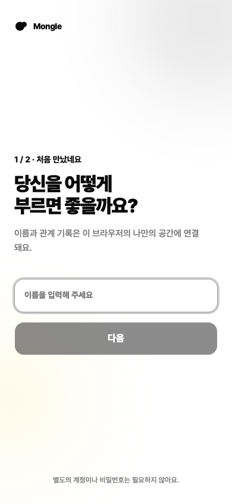
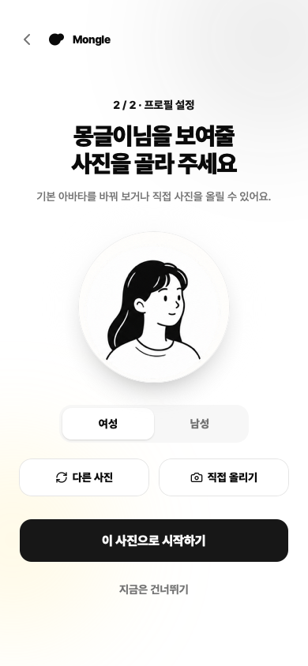
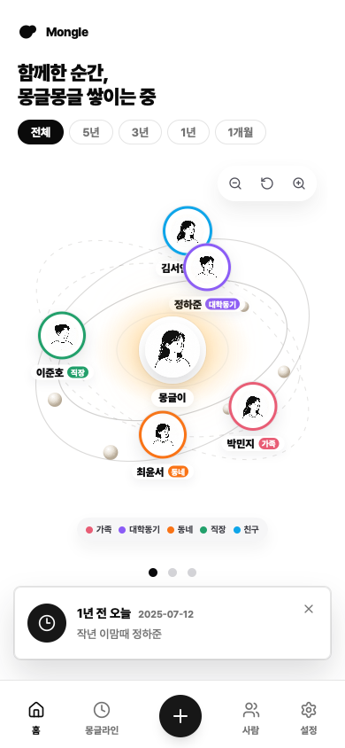
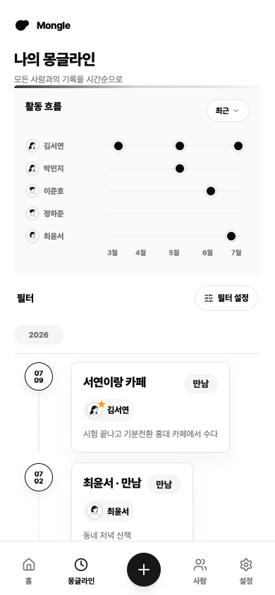
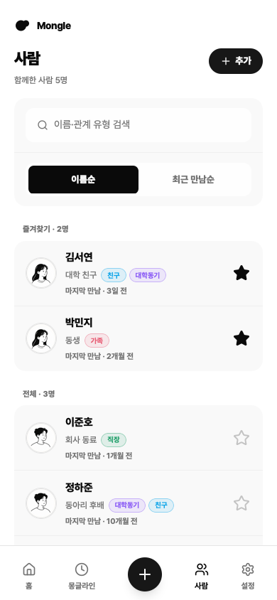
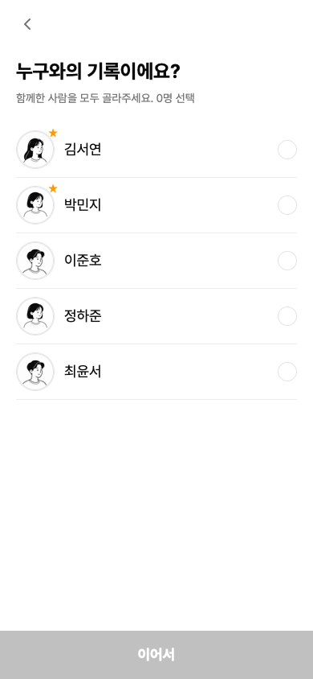

# Mongle

내가 만난 사람과 함께한 순간을 사람 중심으로 기록하고, 관계의 흐름을 다시 꺼내보는 개인 관계 기록 서비스입니다.

연락처처럼 사람의 고정 정보만 저장하지 않습니다. 관계 지도, 사람별 프로필과 타임라인, 감정과 사진이 담긴 기록, 1년 전 오늘의 회고를 한곳에 모읍니다.

## 주요 화면

<table>
  <tr>
    <td align="center"><strong>시작하기</strong></td>
    <td align="center"><strong>프로필 설정</strong></td>
    <td align="center"><strong>관계 지도</strong></td>
  </tr>
  <tr>
    <td></td>
    <td></td>
    <td></td>
  </tr>
  <tr>
    <td align="center"><strong>몽글라인</strong></td>
    <td align="center"><strong>사람</strong></td>
    <td align="center"><strong>기록 작성</strong></td>
  </tr>
  <tr>
    <td></td>
    <td></td>
    <td></td>
  </tr>
</table>

## 현재 제공하는 기능

- 이름과 프로필 이미지로 시작하는 2단계 온보딩
- 나를 중심으로 사람과 관계 태그를 보여주는 관계 지도
- 전체 기록의 시간순 피드와 사람별 활동 흐름 시각화
- 사람 검색·정렬·즐겨찾기, 프로필 등록·수정, 사람별 타임라인
- 함께한 사람, 감정, 내용, 날짜·시간, 날씨, 사진을 나눠 입력하는 기록 작성
- 기록 상세 조회·수정과 1년 전 오늘 회고
- 홈 기본 기간, 개인 태그, 다크 모드 설정
- 모바일 브라우저와 설치형 PWA를 고려한 스택 내비게이션

## 저장소 구성

| 경로                             | 구성                                      | 설명                               |
| -------------------------------- | ----------------------------------------- | ---------------------------------- |
| [`frontend/`](frontend/)         | React 19, Vite, Stackflow, TanStack Query | 모바일 우선 웹·PWA                 |
| [`backend/`](backend/)           | Kotlin, Spring Boot, JPA                  | 인증, 사람, 기록, 타임라인, 칩 API |
| [`docs/prd/`](docs/prd/)         | Markdown                                  | 화면별 제품 요구사항               |
| [`backend/docs/`](backend/docs/) | Markdown                                  | mustpass와 로컬·배포·운영 절차     |

## 로컬 실행

### 준비물

| 도구    | 버전               |
| ------- | ------------------ |
| Node.js | 20.19+ 또는 22.12+ |
| pnpm    | 10+                |
| Docker  | Compose v2 포함    |

### 1. 백엔드

```bash
cd backend
docker compose up -d --build
```

로컬 Docker 백엔드는 `http://localhost:18080`에서 실행됩니다.

```bash
curl http://localhost:18080/actuator/health
# {"status":"UP"}
```

Docker 없이 JDK 21과 H2를 사용할 수도 있습니다.

```bash
cd backend
./gradlew bootRun
# http://localhost:8080
```

### 2. 프런트엔드

```bash
cd frontend
pnpm install
pnpm dev:vite
# http://localhost:3000
```

`pnpm dev:vite`는 `/api`를 기본 Docker 백엔드인 `localhost:18080`으로 프록시합니다. `bootRun`에 연결하려면 다음과 같이 실행합니다.

```bash
BACKEND_URL=http://localhost:8080 pnpm dev:vite
```

사진 업로드까지 확인하려면 Vercel 프로젝트와 Blob 환경변수가 필요합니다. 설정 방법은 [프런트엔드 README](frontend/README.md#사진-업로드)에 있습니다.

## 문서

| 문서                                                 | 내용                            |
| ---------------------------------------------------- | ------------------------------- |
| [프런트엔드 README](frontend/README.md)              | 실행 모드, 구조, API 생성, 검증 |
| [백엔드 README](backend/README.md)                   | API와 화면별 엔드포인트         |
| [로컬 백엔드 Runbook](backend/docs/runbook/local.md) | Docker·H2 실행과 데이터 리셋    |
| [제품 PRD](docs/prd/README.md)                       | 제품 범위와 화면별 기준         |
