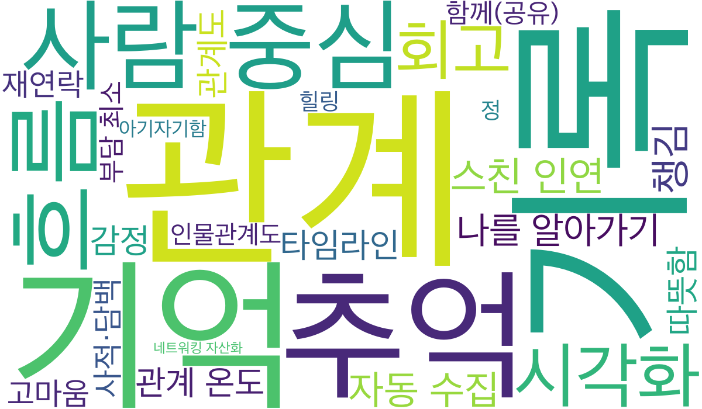

# Step 08. 워드클라우드 만들기

> 목적: 지금까지의 논의를 시각화하여 **나의 생각 → 우리의 생각**으로 맞춘다.

> **Guide:**  
> 1. Agent가 `docs/04`~`07`을 읽고 **키워드·가중치** 표를 채운다.  
> 2. `docs/08_word_cloud.md`의 bash 가이드대로 워드클라우드 이미지를 생성한다.  
> 3. 생성된 이미지를 보며 팀이 중요도를 이야기하고, 가중치를 조정한다. (필요하면 2~3을 반복)

**프롬프트 예시**

```
docs/04~07을 읽고 docs/08_word_cloud.md를 채워줘.
키워드(가중치) 표만 채워줘. 가중치는 1~10 정수로, 중요할수록 크게.
구조와 상단 Guide는 유지하고, 본문 표만 채워줘.
```

## 키워드(가중치)

> `docs/04`~`07`에서 추출한 키워드. 가중치가 클수록 워드클라우드에서 크게 표시된다.

| 키워드 | 가중치 |
|---|---|
| 관계 | 10 |
| 기록 | 10 |
| 기억 | 9 |
| 추억 | 9 |
| 사람 중심 | 8 |
| 흐름 | 8 |
| 시각화 | 8 |
| 회고 | 7 |
| 스친 인연 | 7 |
| 챙김 | 7 |
| 자동 수집 | 7 |
| 나를 알아가기 | 6 |
| 관계 온도 | 6 |
| 타임라인 | 6 |
| 따뜻함 | 6 |
| 감정 | 6 |
| 관계도 | 6 |
| 재연락 | 5 |
| 고마움 | 5 |
| 사적·담백 | 5 |
| 함께(공유) | 5 |
| 부담 최소 | 5 |
| 인물관계도 | 5 |
| 힐링 | 4 |
| 정 | 4 |
| 아기자기함 | 3 |
| 네트워킹 자산화 | 3 |

## 워드클라우드

```bash
# 의존성 설치
python3 -m venv .venv
source .venv/bin/activate
pip install -r requirements.txt

# 워드클라우드 이미지 생성
source .venv/bin/activate
python scripts/generate_word_cloud.py
```

**Agent 지시 프롬프트**

```
docs/08_word_cloud.md의 bash 가이드를 참고해서 의존성을 설치하고, scripts/generate_word_cloud.py로 docs/assets/word_cloud.png를 생성해줘.
완료되면 생성된 파일 경로와 포함된 키워드 개수를 알려줘.
```


